# Automated Deployment and Configuration with Ansible for FastAPI Boilerplate

## Table of Contents

- [Introduction](#introduction)
- [Prerequisites](#prerequisites)
- [Files Overview](#files-overview)
- [Testing](#testing)
  - [1. Playbook Execution](#1-playbook-execution)
  - [2. Application Running Confirmation](#2-application-running-confirmation)
  - [3. User Verification](#3-user-verification)
  - [4. Sudo Group Verification](#4-sudo-group-verification)
  - [5. Sudoers File Verification](#5-sudoers-file-verification)
  - [6. Error Log Verification](#6-error-log-verification)
  - [7. Output Log Verification](#7-output-log-verification)
  - [8. Log Directory Verification](#8-log-directory-verification)
  - [9. Log File Ownership Verification](#9-log-file-ownership-verification)
  - [10. Repository Cloning Verification](#10-repository-cloning-verification)
  - [11. Cloned Repository Content Verification](#11-cloned-repository-content-verification)
  - [12. Environment Variable Verification](#12-environment-variable-verification)
  - [13. PostgreSQL Credentials Verification](#13-postgresql-credentials-verification)
  - [14. API Endpoint Accessibility Check](#14-api-endpoint-accessibility-check)
  - [15. Direct Application Port Access Test](#15-direct-application-port-access-test)
  - [16. Port 3000 Accessibility Check (Browser)](#16-port-3000-accessibility-check-browser)
- [Summary of Key Points](#summary-of-key-points)
- [Conclusion](#conclusion)

## Introduction

In modern software development, automating deployment and configuration processes is essential for maintaining consistency, reducing human errors, and speeding up delivery times. This project focuses on using Ansible, an Infrastructure as Code (IaC) tool, to automate the deployment of a FastAPI boilerplate application on a remote Ubuntu 22.04 server. The primary challenge addressed is the elimination of manual setup and configuration, which are often time-consuming and error-prone.

To address this challenge, the solution involves creating an Ansible playbook that automates the following tasks:

1. **Cloning the Repository**: The playbook clones the `devops` branch of the FastAPI boilerplate repository from GitHub into the `/opt` directory on the remote server, ensuring the latest code is deployed. The boilerplate repository can be found [here](https://github.com/hngprojects/hng_boilerplate_python_fastapi_web.git).

2. **Installing Dependencies**: It installs all necessary dependencies, including setting up Python environments and libraries required for the FastAPI application to function correctly.

3. **Setting Up PostgreSQL**: A PostgreSQL database is installed and configured, with admin credentials securely stored in `/var/secrets/pg_pw.txt` to enhance security.

4. **Configuring the Application**: The FastAPI application is set to run on `127.0.0.1:3000`, keeping the internal port secure. Nginx version 1.26 is specifically installed and configured to act as a reverse proxy, forwarding traffic from port 80 to the application’s internal port 3000.

5. **Logging Configuration**: The playbook sets up logging to capture both `stderr` and `stdout` outputs, saving them in `/var/log/stage_5b/error.log` and `/var/log/stage_5b/out.log`, respectively. These log files are owned by the `hng` user, ensuring appropriate access and management.

6. **User and Directory Setup**: A user named `hng` with sudo privileges is created, and necessary directories are established with the correct permissions to securely handle application files, logs, and secrets.

By automating these tasks with Ansible, the deployment process becomes consistent, repeatable, and free from the common pitfalls of manual configuration. This automation not only saves time but also adheres to best practices for secure, scalable, and reliable infrastructure management.

## Prerequisites

Before running the Ansible playbook for this project, ensure the following prerequisites are met:

1. **Ansible Installed on Control Machine**: Ansible must be installed on your local machine (control machine). You can install Ansible using a package manager like `apt` for Ubuntu:

   ```bash
   sudo apt update
   sudo apt install ansible -y
   ```

2. **SSH Access to Target Server**: You need SSH access to the Ubuntu 22.04 server where the FastAPI application will be deployed. Ensure SSH keys are configured for passwordless access, or be ready to provide SSH credentials during the deployment process.

Meeting these prerequisites ensures a smooth execution of the Ansible playbook, enabling you to automate the deployment and configuration of your FastAPI boilerplate application effectively.

## Files Overview

The Ansible project for automating the deployment and configuration of the FastAPI boilerplate application consists of several key files, each playing a crucial role in ensuring a smooth and secure setup. Here’s a detailed breakdown of each file, with a particular focus on the `main.yaml` playbook:

1. **`main.yaml`**: This is the central Ansible playbook that orchestrates the entire deployment process. The playbook is well-documented, with each step clearly commented to explain its purpose. Here’s a breakdown of each major step and how it was achieved:

   - **Step 0: Update apt cache**: This task ensures that the package lists are up-to-date by running `apt update`. This is crucial for installing the latest versions of packages.

   - **Step 1: Check and Create Sudo Group**:
     - **Check if sudo group exists**: This task checks if the `sudo` group exists on the server using the `getent` command. If it doesn't exist, the next task creates it.
     - **Ensure sudo group has sudo privileges**: Modifies the `/etc/sudoers` file to ensure the `sudo` group has the necessary sudo privileges.

   - **Step 2: Create User and Grant Sudo Privileges**:
     - **Install whois package**: Installs the `whois` package, which provides the `mkpasswd` command used to generate a hashed password.
     - **Generate password hash**: Uses `mkpasswd` to create a hashed password for the new user.
     - **Create deploy_user**: Adds a new user named `hng` with sudo privileges and the hashed password.
     - **Grant deploy_user sudo privileges without password**: Updates the `/etc/sudoers` file to allow the `hng` user to execute sudo commands without needing to enter a password.

   - **Step 3: Create Directories**:
     - **Create directories (log_dir, local_repo, postgres_cred_dir)**: Creates the necessary directories (`/var/log/stage_5b`, `/opt/stage_5b`, `/var/secrets`) and assigns ownership to the `hng` user, ensuring they have the correct permissions to operate on these directories.

   - **Step 4: Ensure Required Files are Present**:
     - **Ensure Log files are present**: Creates log files (`error.log` and `out.log`) if they don't already exist, with appropriate ownership and permissions.
     - **Ensure postgres_cred file is present**: Creates the PostgreSQL credentials file, ensuring it has strict permissions for security.

   - **Step 5: Install Python Packages**:
     - **Ensure python3-venv and python3-psycopg2 are installed**: Installs necessary Python packages to set up a virtual environment and interact with PostgreSQL.

   - **Step 6: Clone the Git Repository**:
     - **Clone the git repository**: Uses the Ansible `git` module to clone the specified branch of the FastAPI boilerplate repository into the `/opt/stage_5b` directory.

   - **Step 7: Set Up Python Virtual Environment**:
     - **Create virtual environment**: Creates a Python virtual environment in the cloned repository directory.
     - **Activate virtual environment and install dependencies**: Activates the virtual environment and installs all necessary dependencies listed in the `requirements.txt` file.

   - **Step 8: Set Up PostgreSQL**:
     - **Install PostgreSQL and start the service**: Installs PostgreSQL and ensures that the service is running.
     - **Create PostgreSQL database and admin user**: Creates a new database and a PostgreSQL admin user, then saves the credentials securely in `/var/secrets/pg_pw.txt`.
     - **Create a dummy table and data in PostgreSQL database**: Executes SQL commands to create a dummy table and insert dummy data, verifying the setup.

   - **Step 9: Configure Application Environment**:
     - **Copy and update .env file**: Copies a sample environment file and updates it with the necessary PostgreSQL connection details and other environment variables.

   - **Step 10: Run FastAPI Application**:
     - **Run FastAPI application**: Uses `nohup` and `uvicorn` to start the FastAPI application in the background, allowing it to run continuously without being tied to a terminal session.

   - **Step 11: Install and Configure Nginx**:
     - **Install Nginx version 1.26**: Installs a specific version of Nginx from the official repository.
     - **Remove default Nginx site configuration and create new configuration**: Removes the default configuration and replaces it with a custom configuration using a Jinja2 template (`nginx.conf.j2`), which sets up Nginx as a reverse proxy to forward traffic from port 80 to the application on port 3000.

   - **Step 12: Log Output and Errors**:
     - **Log the output and error of all tasks**: Captures the output and error messages from each task and writes them to the respective log files (`out.log` and `error.log`), ensuring that any issues can be easily diagnosed and fixed.

   - **Handlers**: The playbook includes a handler to restart Nginx whenever its configuration is changed, ensuring that the web server always operates with the latest settings.

    Each of these steps is carefully designed to automate the setup process, ensuring a secure, reliable, and efficient deployment of the FastAPI application.

2. **`ansible.cfg`**: This configuration file for Ansible specifies settings like the temporary directory for Ansible operations (`remote_tmp`), allowing world-readable temporary files, and disabling host key checking (`host_key_checking`) to avoid SSH interruptions.

3. **`nginx.conf.j2`**: A Jinja2 template for Nginx configuration, enabling Nginx to act as a reverse proxy. It dynamically generates configuration based on playbook variables, ensuring that the server is set up correctly to forward requests from port 80 to the application running on port 3000.

These files form a robust and automated deployment solution, which you can explore further in the [GitHub repository](https://github.com/Hamed-Ayodeji/HNG-internship-stage_5b.git).

## Testing

To validate the successful deployment and configuration of the FastAPI application, a series of tests were conducted using a test inventory file. The following screenshots capture the output from running the Ansible playbook and verifying the setup on the remote server.

### 1. Playbook Execution

   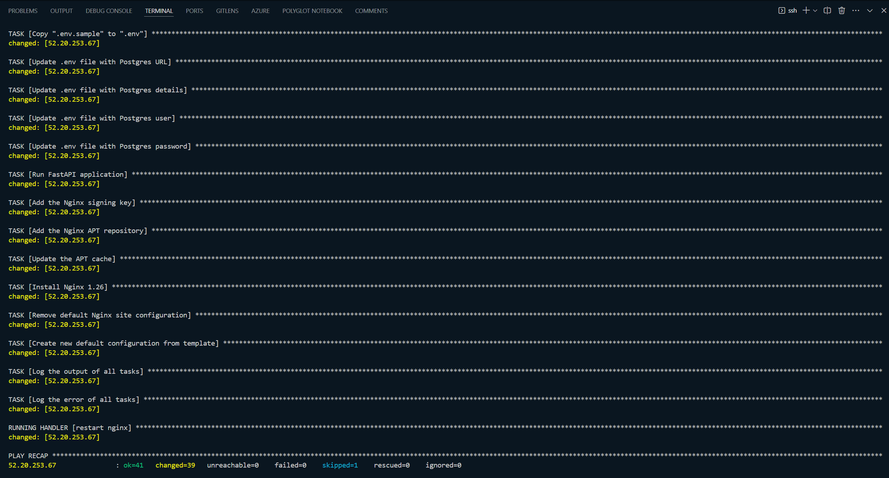

- This screenshot shows the terminal output from running the Ansible playbook. All tasks were executed successfully, as indicated by the `ok` and `changed` statuses, with no failures (`failed=0`). This confirms that each step of the deployment, including setting up users, installing dependencies, configuring Nginx, and starting the application, was completed without errors.

### 2. Application Running Confirmation

   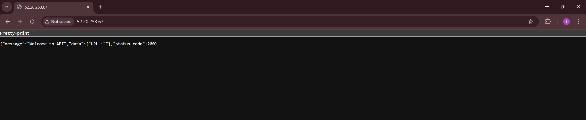

- The web browser displays the application's welcome message, confirming that the FastAPI application is successfully running and accessible through Nginx on port 80. This verifies the correct setup of the application and the reverse proxy configuration.

### 3. User Verification

   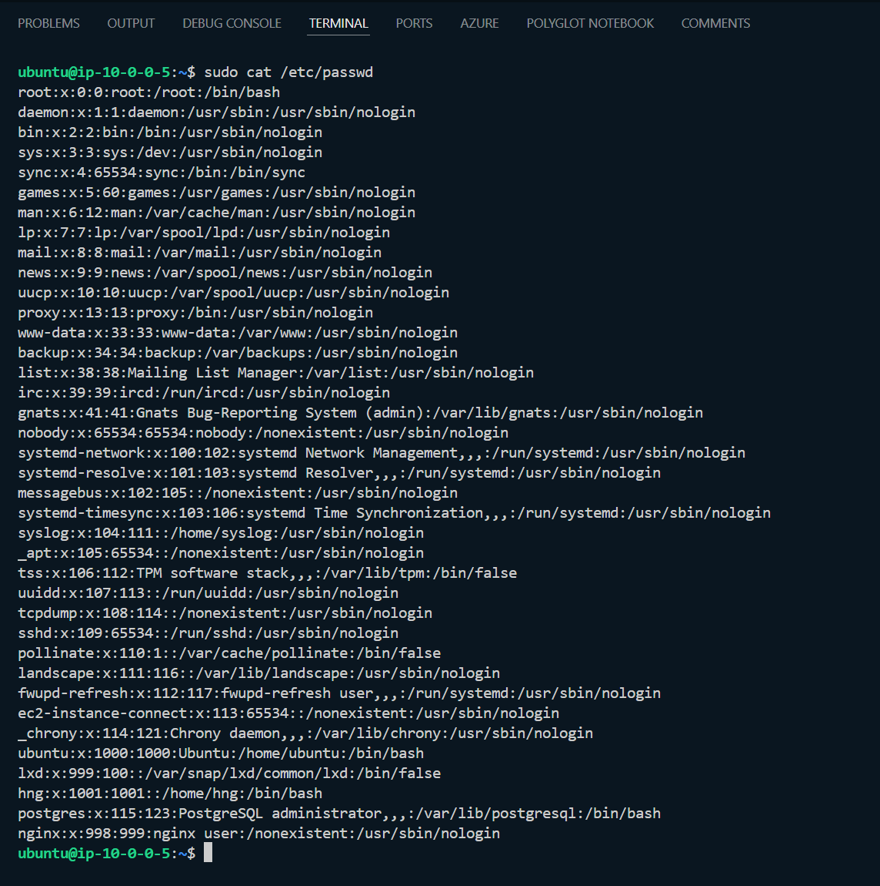

- The terminal output shows the `/etc/passwd` file contents, confirming the creation of the `hng` user as specified in the playbook. The `hng` user has been successfully added to the system, verifying that the user setup was performed correctly.

### 4. Sudo Group Verification

   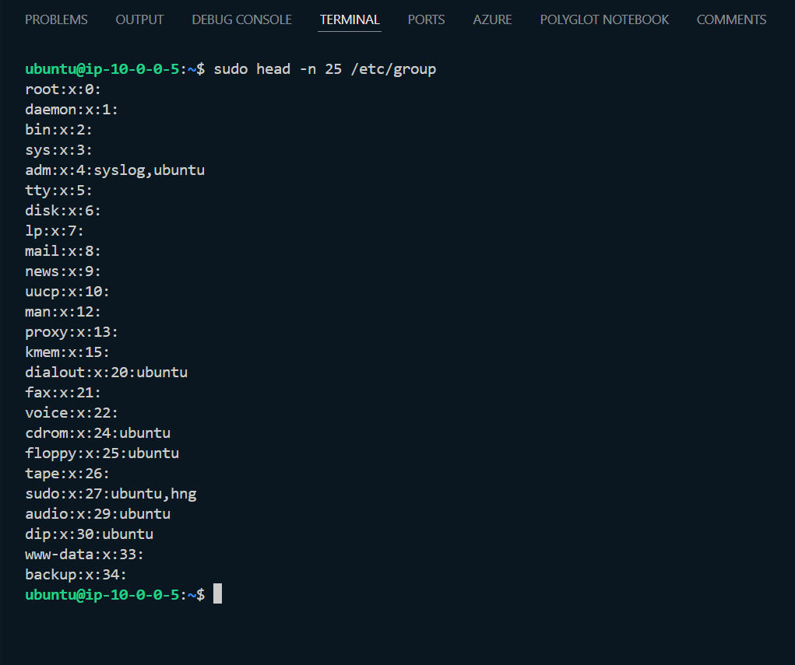

- This screenshot verifies that the `hng` user is part of the `sudo` group. The terminal output lists the contents of the `/etc/group` file, showing that `hng` is included in the `sudo` group, which confirms that the user has sudo privileges.

### 5. Sudoers File Verification

   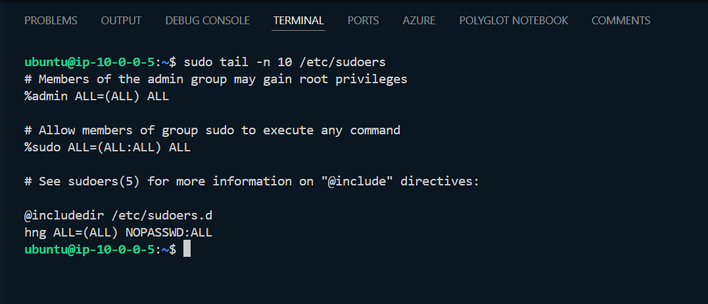

- The terminal output shows the last 10 lines of the `/etc/sudoers` file, confirming that the `hng` user has been granted `NOPASSWD` sudo privileges, as required by the playbook. This ensures that the user can perform administrative tasks without needing to enter a password.

### 6. Error Log Verification

   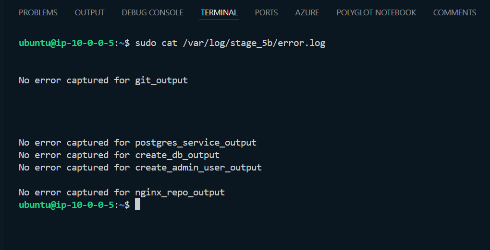

- The screenshot displays the contents of `/var/log/stage_5b/error.log`, showing that no errors were captured for critical output tasks. This indicates that the playbook ran smoothly without any significant issues during execution.

### 7. Output Log Verification

   [Output Log Verification](./out.log.md)

- This displays the contents of `/var/log/stage_5b/out.log`, showing the output of the playbook tasks. The log file captures the standard output of each task, providing a detailed record of the playbook execution for troubleshooting and monitoring purposes.

### 8. Log Directory Verification

   

- The terminal output lists the contents of the `/var/log` directory, including the `stage_5b` folder. This confirms that the logging directory was created correctly, and logs are stored as intended.

### 9. Log File Ownership Verification

   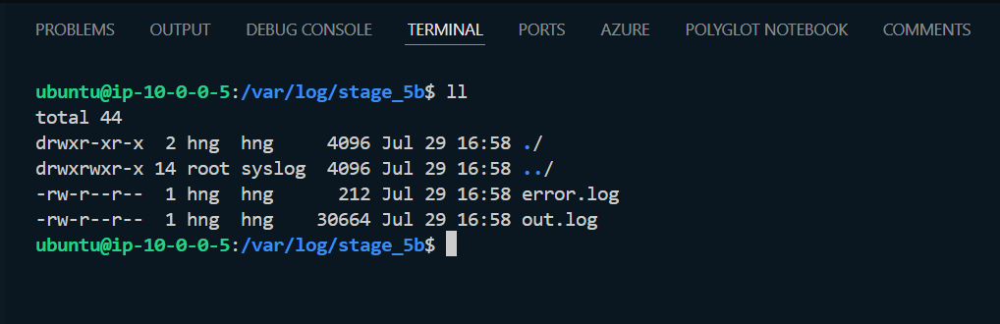

- The screenshot shows the file permissions and ownership for `error.log` and `out.log` within the `/var/log/stage_5b` directory. The files are owned by the `hng` user, as required, confirming that log file permissions and ownership were set up correctly.

### 10. Repository Cloning Verification

   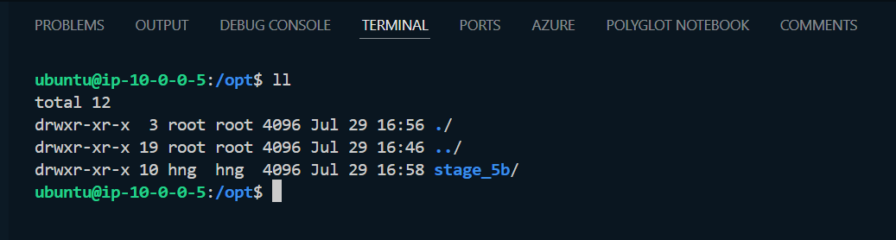

- The terminal output lists the contents of the `/opt` directory, showing that the repository was cloned into the `stage_5b` folder as specified in the playbook. This confirms that the repository cloning step was successfully executed.

### 11. Cloned Repository Content Verification

   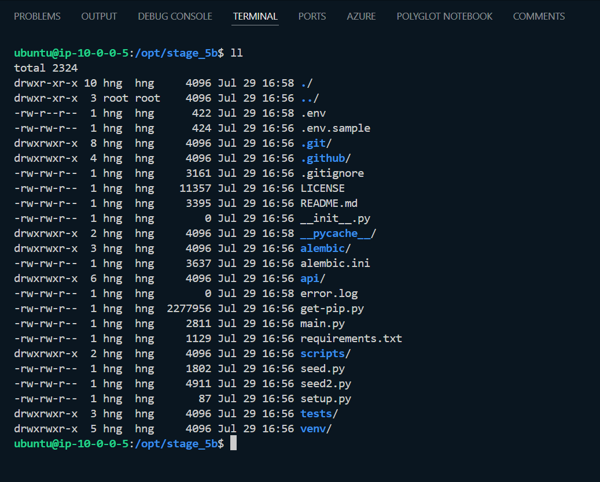

- This screenshot shows the contents of the `/opt/stage_5b` directory, confirming that all necessary files and directories from the repository were successfully cloned and are present on the server.

### 12. Environment Variable Verification

   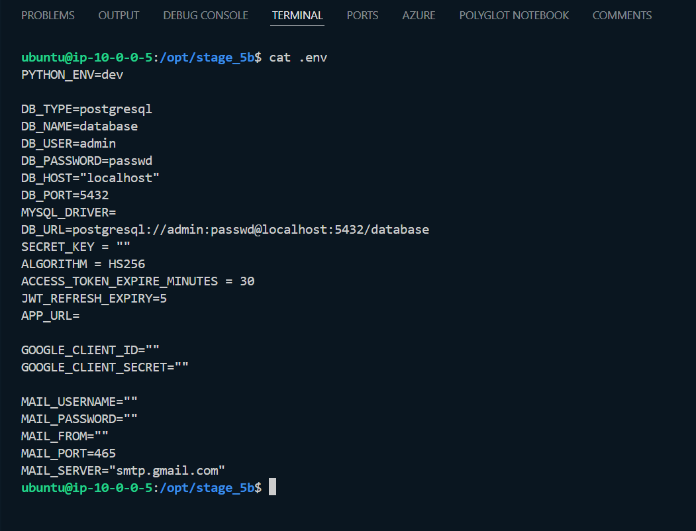

- This screenshot shows the contents of the `.env` file located in the `/opt/stage_5b` directory. It confirms that the PostgreSQL database credentials and other environment variables have been correctly set, as configured by the playbook. This ensures that the application is set up with the correct environment settings.

### 13. PostgreSQL Credentials Verification

   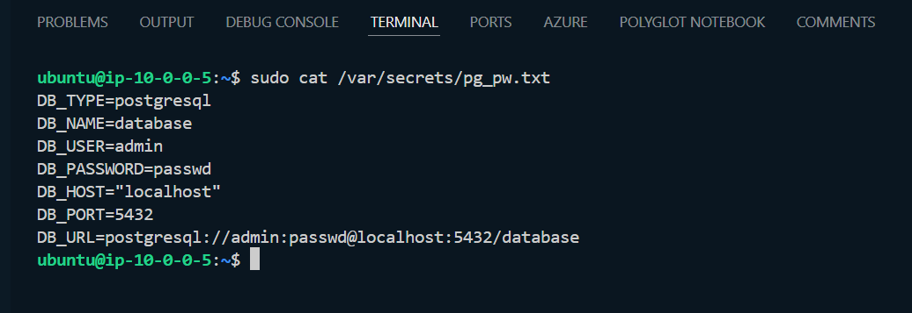

- The screenshot displays the contents of `/var/secrets/pg_pw.txt`, verifying that the PostgreSQL database credentials have been securely stored in the specified file. This confirms that the playbook properly configured the database settings and stored the credentials in a secure location.

### 14. API Endpoint Accessibility Check

   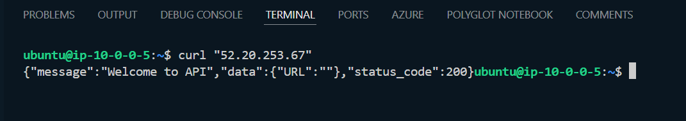

- This screenshot shows a successful `curl` request to the public IP address `52.20.253.67`, returning a welcome message from the API. This indicates that the application is correctly running and accessible through the configured Nginx reverse proxy on port 80.

### 15. Direct Application Port Access Test

   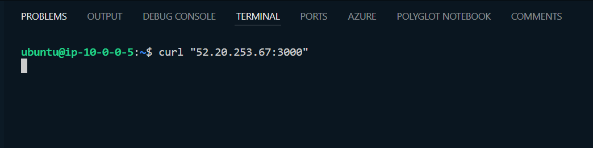

- The terminal output shows a `curl` request to `52.20.253.67:3000`, which does not return a response. This confirms that the application is not directly exposed on port 3000, aligning with the requirement to keep the internal port secure and only accessible through Nginx.

### 16. Port 3000 Accessibility Check (Browser)

   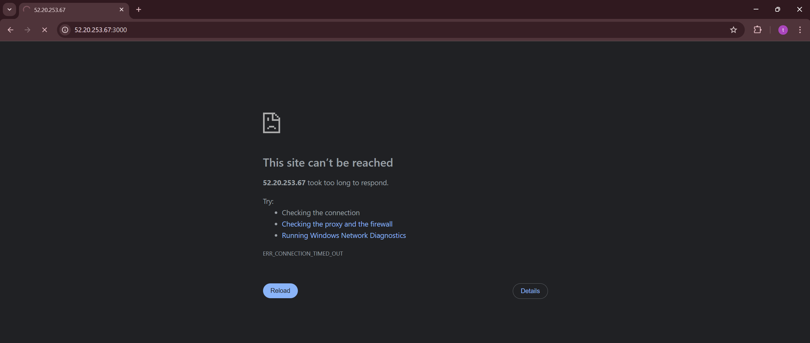

- The browser displays an error when trying to access `52.20.253.67:3000`, further confirming that port 3000 is not accessible externally. This confirms the security configuration that the application should only be accessible via Nginx on port 80.

These screenshots collectively demonstrate that the Ansible playbook successfully automated the deployment, configuration, and security of the FastAPI application, meeting all specified requirements. The testing process confirms that all components are correctly configured and functioning as expected.

## Summary of Key Points

- **Automated Deployment**: The project used Ansible to automate the deployment and configuration of a FastAPI application, streamlining the setup process and minimizing errors.
- **Comprehensive Playbook**: The `main.yaml` playbook handled all tasks, from user creation to application setup and security configurations, ensuring a consistent and secure environment.
- **Successful Testing**: Extensive testing confirmed that all requirements were met, including correct user setup, application accessibility, and secure database configuration.
- **Security Focus**: The setup securely managed sensitive data and restricted access to internal services, aligning with best practices for application deployment.

## Conclusion

By leveraging Ansible for automated deployment, this project achieved a secure and efficient setup of the FastAPI application. The automation not only saved time but also ensured a reliable, repeatable deployment process. The successful implementation demonstrates the value of Infrastructure as Code in modern software development. For more details, visit the [GitHub repository](https://github.com/Hamed-Ayodeji/HNG-internship-stage_5b.git) and [HNG FastAPI boilerplate GitHub repository](https://github.com/hngprojects/hng_boilerplate_python_fastapi_web.git).
